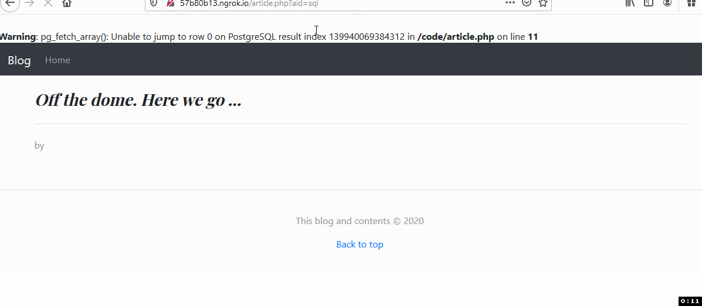

# Assignment 2 Writeup

For the web application provided, I tested for the following known vulnerabilities that were mentioned in the description of the [assignment](PROG38263-Assignment2-Winter2020.pdf)

## Cross-Site Scripting (XSS):

- **Identification:** For finding where XSS vulnerability could be exploited, as one of use case I identified text areas across the platform which were on the editing article webpage aka Title and article text.

- **Execution:** After identifying potential text areas, I inserted simple script tags with alert message popups in those text areas and was successful in exploiting them. I have attached the documented proof below.

- **Impact:** Although I managed to exploit a simple case of popping up an alert box, however, attackers could leverage XSS to launch attacks such as account hijacking to steal the session cookies and thus fully compromise the website. I could also steal credentials by cloning the login page of the web application and then using the XSS vulnerability in order to serve it to the victims.

- **Mitigation:** One of the security control measures that can be employed to mitigate XSS attack is to encode all fields when displaying them in the browser. Additionally, ensure that text is properly filtered or sanitized or use a third-party plugin like an HTML purifier or also use the function `htmlspecialchars()`.

## SQL Injection

- **Identification:** For finding this

- **Execution:**

- **Impact:**

- **Mitigation:** Security Control

## Broken Access Control

- **Identification:** For finding this

- **Execution:**

- **Impact:**

- **Mitigation:** Security Control

## Missing role-based access control enforcement and management

- **Identification:** For finding this

- **Execution:**

- **Impact:**

- **Mitigation:** Security Control

## Insecure password handling and storage

- **Identification:** For finding this

- **Execution:**

- **Impact:**

- **Mitigation:** Security Control

## CSRF

- **Identification:** For finding this

- **Execution:**

- **Impact:**

-**Mitigation:** Security Control

## No security certificate (https)

- **Identification:** For finding this

- **Execution:**

- **Impact:**

- **Mitigation:** Security Control

## Only default logs

- **Identification:** For finding this

- **Execution:**

- **Impact:**

- **Mitigation:** Security Control
