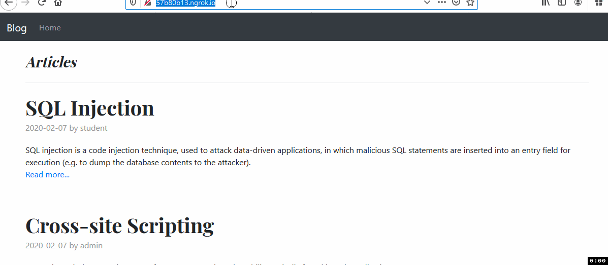
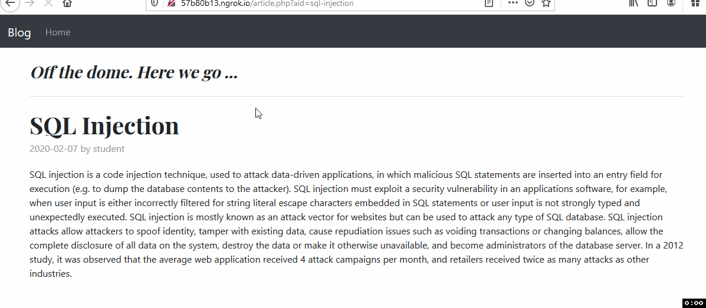
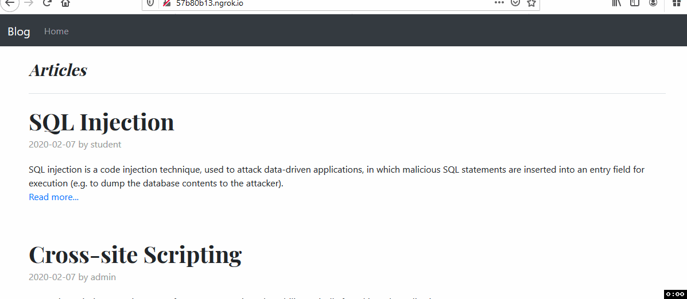
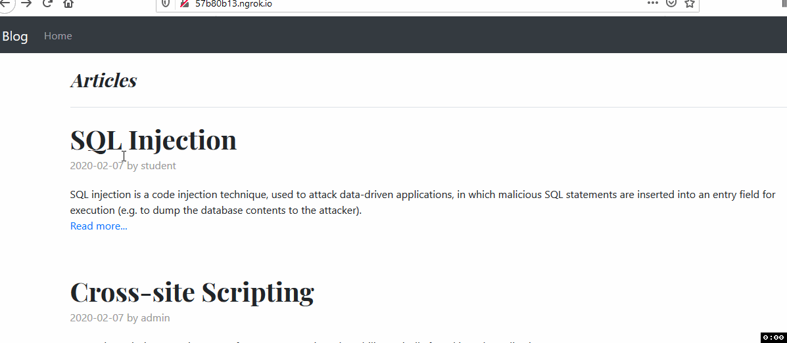
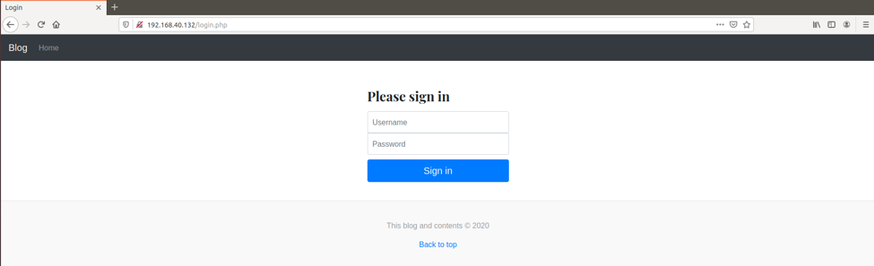
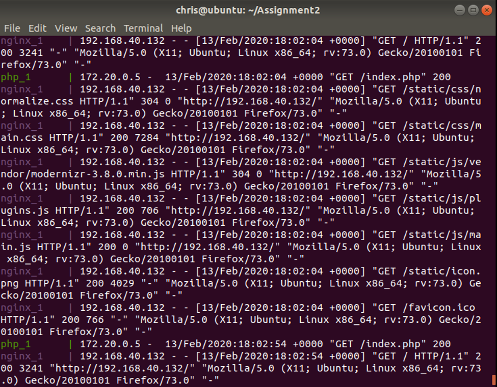
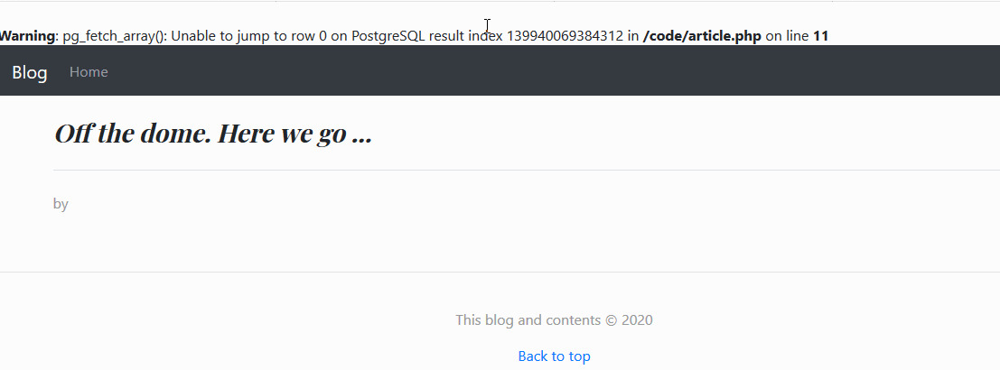

# Assignment 2 Writeup

For the web application provided, I tested for the following known vulnerabilities that were mentioned in the description of the [assignment](PROG38263-Assignment2-Winter2020.pdf)

## Cross-Site Scripting (XSS)

- **Identification:** For finding where XSS vulnerability could be exploited I explored the platform to where user could input data and found text areas in the editing article webpage aka Title and article text.

- **Execution:** After identifying potential text areas, I inserted simple script tags with alert message popups in those text areas and was successful in exploiting them. I have attached the documented proof below.



- **Impact:** Although I managed to exploit a simple case of popping up an alert box, however, attackers could leverage XSS to launch attacks such as account hijacking to steal the session cookies and thus fully compromise the website. I could also steal credentials by cloning the login page of the web application and then using the XSS vulnerability in order to serve it to the victims.

- **Mitigation:** One of the security control measures that can be employed to mitigate XSS attack is to encode all fields when displaying them in the browser. Additionally, ensure that text is properly filtered or sanitized or use a third-party plugin like an HTML purifier or also use the function `htmlspecialchars()`.

## SQL Injection

- **Identification:** To know if the website could be exploited with sql injection, i tried to identify webpages which projected data from database and tried passing incorrect data as parameters. Through which and without proper logs on website i found out the database used and some information about query handing.

- **Execution:** For the execution on the above identified page, I ran _sqlmap_ tool to check for any potential injection attacks and the tool gave there cases. I selected a case and tried to find table names and column name and then passed on a sql injection attacked which would give user login details and we could find admin user login credentials.



- **Impact:** High impact, in real life this succesful attack will comprise the whole website and server.

- **Mitigation:** To mitigating most of sql injection attacks i used prepared statements and parameterized queries. An advanced option is to use external driver tools like PDO (data objects) to achieve immunity from sql injection attacks, below is an example of mysql prepare statement in php.

```php
    $stmt = $dbConnection->prepare('SELECT * FROM employees WHERE name = ?');Security Control
```

## Missing role-based access control enforcement and management

- **Identification:** It was evident that the access control was broken when i logged in with student user.

- **Execution:** The student could access the functionalities like modifying and deleting every article on website once logged in rather than only the posts which were created by him.



- **Impact:** Giving user more control than needed will cause choas in the application, now with giving normal user access to admin pages if user was a bad actor could go ahead and clean the webiste and insert malicious scripts on all the webpages which could steal other users login details and execute other attacks.

- **Mitigation:** To mitigate this vunerability there is need to implement role-based access properly. On this code base, i added role of user in the session and hardcoded a crosscheck on every page, as a usecase but in realworld more complex systems can be implemnted.

## Broken Access Control

- **Identification:** To check if this vunerability exists on this code base, I tried to access various pages without logging in as either student or admin.

- **Execution:** I identified that i could access deletearticle when passed with valid aid parameter executes the sql command without checking if user is logged in or not.




- **Impact:** Attackers can act as users or administrators using privileged functions can delete every record. The business impact depends on the protection needs of the application and data.

- **Mitigation:** Access control can be only effective if enforced in trusted server-side code or server-less API, where the attacker cannot modify the access control check or metadata.

## Insecure password handling and storage

- **Identification & Execution:** The above sql injection attack video also demonnstartes insecure password handling as it revealed both username and password to attacker in plain text.

- **Impact:** High impact and will expose admin previlages to an attacker.

- **Mitigation:** We can mitigate this attack by encrpyting passwords on database by defualt. If the password were encrypted the attack would only give a hashcode of password.

## CSRF

- **Identification & Execution:** When the sql injection attack was succesful and compromised a user. The attacker can act as that user and insert a new article with malicous code that will in turn execute a reflected csrf attack with an action form, when other users read the article or visit website the action form would change visited user password and logs the information to attacker's server.

```html
<html>
  <body>
    <form action="https://vulnerable-website.com/password/change" method="POST">
      <input type="hidden" name="password" value="youarepwned" />
      <input
        type="hidden"
        name="username"
        value="<?php"
        $_Session[username]
      />/>
    </form>
    <script>
      document.forms[0].submit();
    </script>
  </body>
</html>
```

- **Impact:** As it is a request forgery attack in which the attacker impersonates another legitimate user in targeting the victim website. Depending on the functionality provided by the web application that is being targeted, the impact can vary from annoyances to administrative control for the attacker but in our case in this code we could get admin login details.

- **Mitigation:** The most robust way to defend against CSRF attacks is to include a CSRF token within relevant requests. The token should be unpredictable with high entropy, linked to the user's session and strictly validated in every case before an action is executed.

## No security certificate (https)

- **Identification & Execution:** Using _Wireshark, Aircrack-ng_ tool suite, i could sniff the traffic from vm to the container and accesspoint to find authencation packets.



- **Impact:** Man in middle attacks can happen and attackers can sniff data, which can compromise user credential and other personal information.

- **Mitigation:** In real projects enforcing https and using a valid ca certificate for the application and all the plugins used, here in our case i could make a self-assigned secure certificate for nginx conatiner.

## Only default logs

- **Identification & Execution:** Exposing default logs when user enters incorrect data as shown in below figures might help attackers.





- **Impact:** Low impact, not having logs or having default logs makes it for attackers and general users to know more about the hosting server, compenents like databases, frameworks and raw code. Which might help advanced users to understand internal schematics of the application with less to no impact. But for naive users it would be hard to understand what went wrong.

- **Mitigation:** To mitigate this risk and to help developers to better understand errors, I used defualt php `error_log` function and also sent simple error message to end users.
